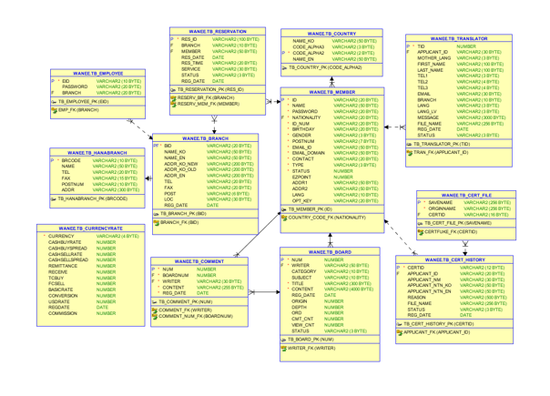
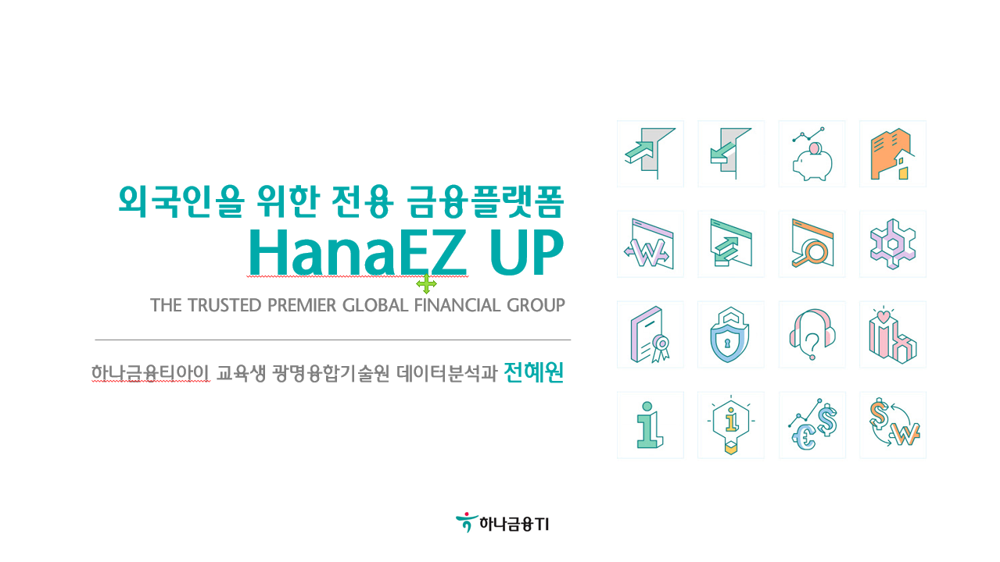

# 프로젝트 제목

[프로젝트 홈페이지]

https://koposoftware.github.io/2020_6_hwjeon/

# 1. 프로젝트 개요

2020년, 국내 체류 외국인은 250만 명에 달하며 사상 최고치를 기록하고 있다. 외국인의 국내 금융거래도 덩달아 증가하며 시중 은행 모두 주목하는 큰 시장이 되고 있지만, 아직 제도적 한계로 외국인의 비대면 금융거래는 제한이 많다.
 이에 따라 국내 외국인을 대상으로 하는 종합 금융 플랫폼을 주제로 정하고, 어떤 서비스를 제공할 수 있을지 고민을 담아 프로젝트를 진행해보았다.
 
 
# 2. 프로젝트 제안서

## 2-1. 발표 자료   
[HanaEZ UP](/최종발표_전혜원.pdf) 

## 2-2. 시스템 아키텍쳐 및 ERD
 
 

 

# 3. 프로젝트 결과

## 3-1. 발표 자료 
   [발표자료 pdf](/최종발표_전혜원.pdf) 
    
   
## 3-2. HanaSafe 프로젝트 요약

### 수행기간

2020.09.02 ~ 2020.10.05
 

### 담당 업무

HanaEZ UP 설계 및 제작, 코딩
 

### 사용기술

Spring MVC 기반 웹 애플리케이션 제작 
Google VISION OCR 광학 문자 인식 
Spring Locale 한국어, 영어, 태국어 3개 언어 지원 
Apache POI 엑셀 다운로드 
JavaMailSender 이메일 전송 
Twilio API 문자 전송 
Kakao MAP 지도 반환, 주소로 좌표검색 
Window Task Scheduler, Python 환율 정보 크롤링 
Spring Scheduler 기반 예약 송금 
 

### 개발 환경

JDK 1.8, Window10, OracleXE 11g, Tomcat9
 

### Language / Tool / DB

Language : HTML, CSS, Javascript, Python, Java 
Framework : Spring, MyBatis, Bootstrap, WebSocket 
Database : Oracle DBMS 
Server : Tomcat 
Etc : Git(Git Bash)
 

### 요구사항

<비대면 실명인증>
- 문자로 인증번호 전송받아 본인인증
- 외국인등록증을 업로드하여 비대면 실명인증 신청
- 관리자가 신청내역 조회 시 API를 통해 텍스트가 자동 추출
- 정보를 기입하고 법무부 시스템(가상)에서 조회시 진위여부 확인
- 신청 내역 엑셀로 다운로드

<지점 이용예약>
- 주소, 지점명으로 외국인 특화 일요영업점 검색
- 한글과 영어로 모두 검색 가능
- 선택한 지점에서 원하는 날짜, 시간, 서비스 예약
- 예약내역은 이메일로 전송

<통역사 + 금융상담게시판>
- 통역사 신청 후 승인을 거쳐 선발
- 선발된 통역사만 '금융상담 게시판'에 댓글등록 가능
- 관리자는 부적절한 글을 숨김처리 가능
- 숨김처리 된 글을 따로 확인하고 관리

### 기대효과

<기대효과>
1) 기존 하나은행이 외국인 전용 브랜드로 밀고있던 'Easy(또는 EZ)'를 계승, 확장해 기존 고객들이 혼란을 겪지 않을 수 있다.
2) 간편한 가입 및 인증절차로 국내 계좌를 개시하지 않은 외국인 손님들이 유입되기 쉽다.
3) 일단 사용을 시작하면 타 서비스로 잘 이탈하지 않게 되는 플랫폼의 Lock-In 특성으로 외국인 손님 충성도를 높일 수 있다.
 

# 4. 본인 소개

|이름 |전혜원(Hyewon Jeon)|gdKO| |연락처 | 2060340007(@)office.kopo.ac.kr| |skill set| Frontend - HTML, CSS, Javascript| | | Backend - Java, Spring, Oracle| |자격증| GA(Google Analysis) | |수상| UN Women Golbal Partnership 2nd runner-up | |특기사항| TOEIC 905, FLEX Thai 864.9 |

